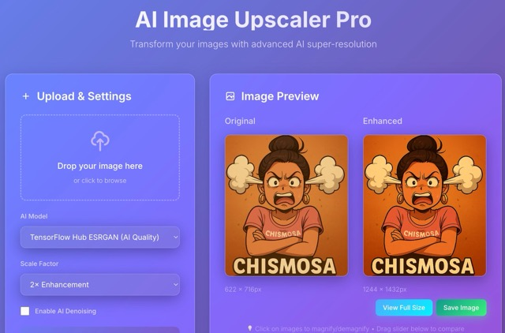
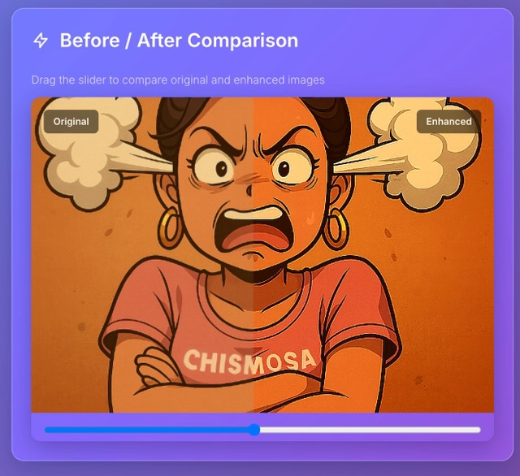

	
	

AI Image Upscaler (FastAPI + Frontend)

Overview
- Backend: FastAPI with two paths
	- PIL Real-ESRGAN-style upscaler (fast baseline, 2x/4x/8x)
	- TensorFlow Hub ESRGAN 4x (optional, uses Metal on Apple Silicon)
- Frontend: Vanilla HTML/JS (drag & drop, preview, split before/after)

Requirements
- macOS, Python 3.10+
- Recommended: virtualenv
- Optional (for TF Hub): tensorflow-macos, tensorflow-metal, tensorflow-hub

Quick start
1) Create/activate venv
	 python -m venv .venv
	 source .venv/bin/activate

2) Install deps
	 pip install -r requirements.txt  # if present
	 # Optional: enable TF Hub model
	 pip install tensorflow-macos tensorflow-metal tensorflow-hub

3) Run server
	 uvicorn app.main:app --reload

4) Open UI
	 http://127.0.0.1:8000/

Frontend usage
- Drop/click to select an image.
- Choose model:
	- PIL Real‑ESRGAN (fast): scale 2x/4x/8x, optional denoise.
	- TensorFlow Hub ESRGAN (AI Quality): fixed 4x, uses Metal if installed.
- Click “Enhance Image”; progress updates until the result is ready.
- Compare with the slider and save the enhanced image.

API (v1)
- Create job
	POST /api/v1/upscale/job
	form fields: file, factor (2|4|8), denoise (bool), use_tfhub (bool)

- Get status
	GET /api/v1/upscale/job/{id}

- Get result
	GET /api/v1/upscale/job/{id}/result

Notes
- TF Hub ESRGAN uses 4x scaling regardless of requested factor.
- Static frontend is served from /static (frontend/src/*) and index at /. 
